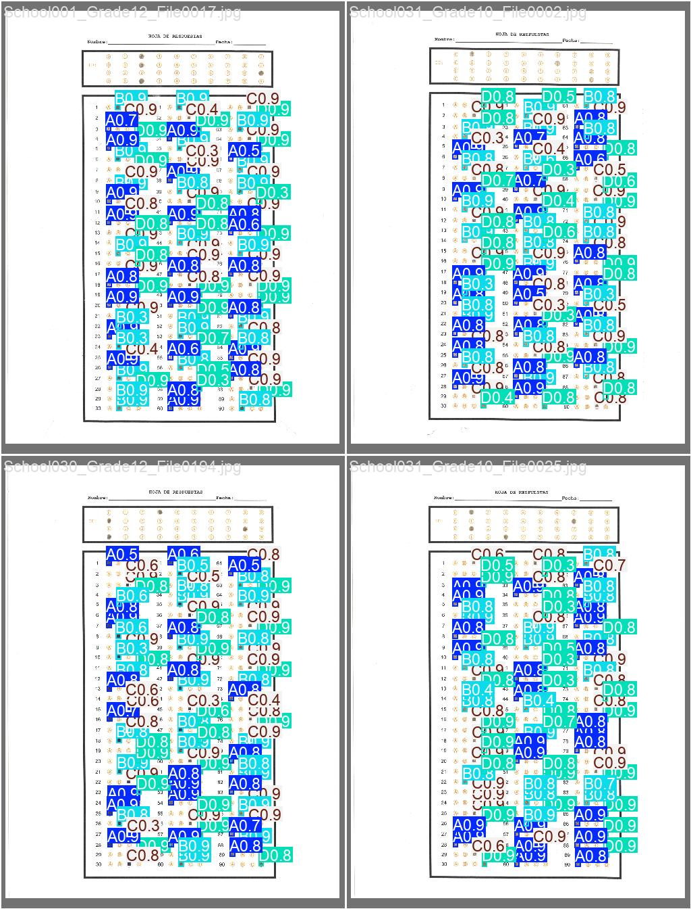

# Multiple-Choise-Recognition

Python project for training and evaluating a neural network to detect marked answers on multiple-choice answer sheets.

The intended pipeline combines image preprocessing and vision-based detection to identify answer regions in scanned or photographed forms, classify filled alternatives, and generate structured outputs for automated grading workflows.

## Experiment Log

### 2026-05-21

This experiment was run with an `80/20` train/validation split, without data augmentation, and without using the `tamaulipas` dataset.

Dataset reference: Hernandez-Mier, Y., Nuno-Maganda, M. A., Polanco-Martagon, S., Acosta-Villarreal, G., & Posada-Gomez, R. (2026). *Tamaulipas Multiple-Choice-Question Exam Image Dataset for Optical Mark Recognition Research* [Dataset]. Mendeley Data. https://doi.org/10.17632/DJMYNJWJPY.1

#### Validation Metrics

| Class | Images | Instances | Box(P) | R | mAP50 | mAP50-95 |
| --- | ---: | ---: | ---: | ---: | ---: | ---: |
| all | 219 | 19710 | 0.966 | 0.965 | 0.970 | 0.663 |
| A | 219 | 4964 | 0.957 | 0.979 | 0.969 | 0.660 |
| B | 219 | 5280 | 0.968 | 0.969 | 0.973 | 0.669 |
| C | 219 | 5117 | 0.967 | 0.966 | 0.968 | 0.662 |
| D | 219 | 4349 | 0.973 | 0.948 | 0.969 | 0.662 |

#### Inference Example

Example prediction mosaic generated during validation for this experiment:

